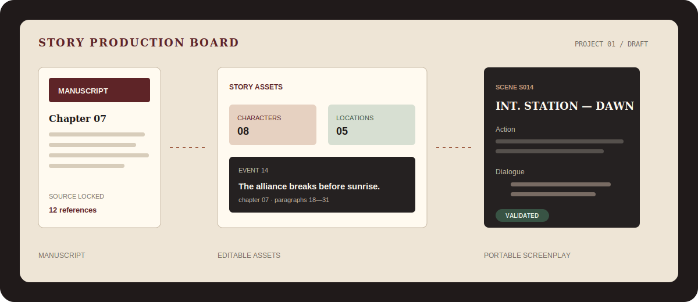
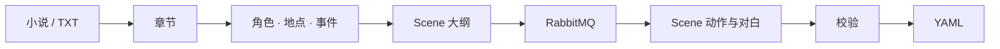

<div align="center">

# AI Novel to Script

小说不是一次 Prompt。改编也不该只得到一整块文本。

[](backend/pom.xml)
[](frontend/package.json)
[](docker-compose.yml)
[](https://www.bilibili.com/video/BV1BpEh6YEpt/)

**[观看完整 Demo](https://www.bilibili.com/video/BV1BpEh6YEpt/)** · [产品说明](PRODUCT.md) · [接口契约](docs/api-contract.md) · [SSE 事件](docs/sse-events.md)

</div>



## 最终得到的不是“AI 写了一版”

输入小说原文，工作台会持续生成一组可以继续编辑和交付的资产：

| 阶段 | 产出 |
| --- | --- |
| 原稿处理 | 章节切分、清洗、章节摘要 |
| 故事资产 | 角色、地点、事件、原文引用 |
| 场景设计 | 有顺序的 Scene 大纲 |
| 剧本生成 | 动作、对白、来源、warnings |
| 交付 | 结构校验报告、YAML 导出 |

角色、地点和事件不是一次调用里的隐藏过程，而是数据库中的正式对象。用户可以检查中间结果，再决定是否继续生成。

## 一条看得见进度的长任务



项目级 SSE 推送真实阶段事件：

```text
TASK_SUBMITTED
ASSET_ANALYSIS_STARTED
OUTLINE_GENERATED
SCENE_COMPLETED  S001
SCENE_COMPLETED  S002
VALIDATION_COMPLETED
```

页面显示系统正在切章节、抽角色还是写某个 Scene，而不是用假进度条掩盖等待。

## 为长时间模型调用做的工程处理

- RabbitMQ 接管长任务，HTTP 请求快速返回。
- 项目级任务默认串行，避免同一项目结果互相覆盖。
- 数据库使用短读、短写事务，模型调用期间释放连接。
- Scene 流式预览先提供阅读反馈，结构化结果单独持久化。
- Mock 和规则兜底明确标注，不冒充真实模型结果。
- 校验器检查动作缺失、对白缺失和角色一致性。

更完整的已知问题和量化材料见 [性能与可靠性审查](docs/performance-reliability-review.md) 与 [`bench/`](bench/)。

## 架构

```text
React + TypeScript + Zustand
          │ REST / SSE
Spring Boot 3.5 + MyBatis
          ├── RabbitMQ  长任务
          ├── MySQL     结构化资产
          ├── Redis     运行协调
          └── AI API    抽取与生成
```

## 本地启动

要求：JDK 17、Node.js 18+、Docker Desktop。

```bash
git clone https://github.com/SCW5370/qiniuyun-ai-novel-to-script.git
cd qiniuyun-ai-novel-to-script
cp .env.example .env
docker compose up -d
```

后端：

```bash
cd backend
./mvnw spring-boot:run
```

前端：

```bash
cd frontend
npm install
npm run dev
```

验证：

```bash
cd backend && ./mvnw test
cd frontend && npm run build
```

项目起源于七牛云实训，当前版本继续加入了异步工作流、SSE、结构校验、YAML 导出和可靠性分析。样例输出位于 [`samples/`](samples/)。
